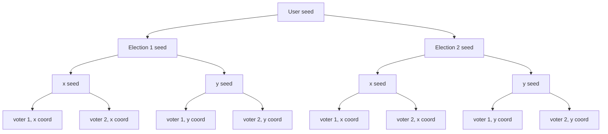

# Project architecture

This is intended to be more in depth, but right now it's just a collection of notes that might be needed in the future

## Seed

The program accepts a single fixed seed for reproducible results

- A user given seed is used to generate a seed for every election (election seed)
- In an election, use the election seed to generate two seeds (x seed and y seed)
- The x seed is used to seed a random number generator for the x coordinate of the voters. Same for the y seed
- Every voter point depends on the x and y seeds
- The x and y seeds depends on the election seed
- The election seed depends on the user seed

This chart shows a run with 2 elections and 2 voters. The number of children of the User seed node is the number of elections. The number of children of the x and y seed nodes is the number of voters.

