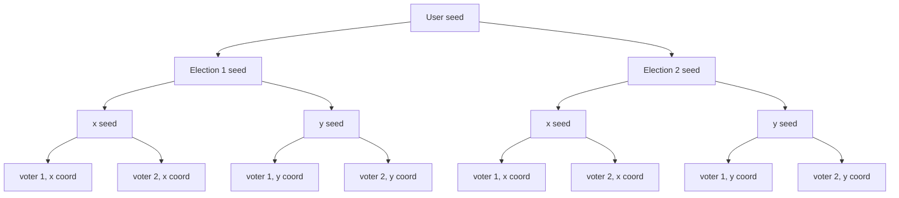
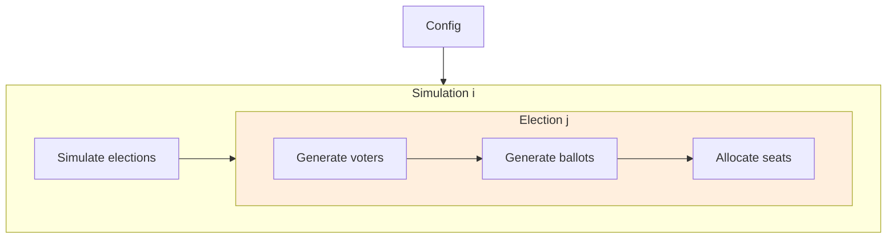

# Project architecture

This is intended to be more in depth, but right now it's just a collection of notes that might be needed in the future

## Seed

The program accepts a single fixed seed for reproducible results

- A user given seed is used to generate a seed for every election (election seed)
- In an election, use the election seed to generate two seeds (x seed and y seed)
- The x seed is used to seed a random number generator for the x coordinate of the voters. Same for the y seed
- Every voter point depends on the x and y seeds
- The x and y seeds depends on the election seed
- The election seed depends on the user seed

This chart shows a run with 2 elections and 2 voters. The number of children of the User seed node is the number of elections. The number of children of the x and y seed nodes is the number of voters.

## Runtime

This is a broad overview of what happens when the binary runs:

1. The config is read and parsed
2. The config may specify multiple simulations to run
3. In each simulation i, it simulates an election j, where j is a point on the grid. There are 200 * 200 points on the grid.
4. In each election j:
    1. A set of voters are randomly generated
    2. Their ballots are determined based on their distances to parties/candidates
    3. The ballots are counted and the seats are allocated

### Parallelism

Clearly, every simulation are independent of each other and every election is independent of all others.

As simulations write their results to a file instead of returning something, there is no synchronization needed. So currently every simulation is ran in parallel with multi-threading.

The results of every election needs to be collected. This is a synchronization barrier. That's still not a problem with rayon anyway. The problem is that there are 200 * 200 elections for each simulation. Scheduling 40000 tasks is...yikes. That's why, currently, elections are ran sequentially.

### Potential work

As allocating seats involves counting the votes, the voters and ballots could be merged together. One can imagine iterating through the voters and incrementing the vote counts for a particular candidate. This only works for n-mark ballots and not ranked ballots (STV).

