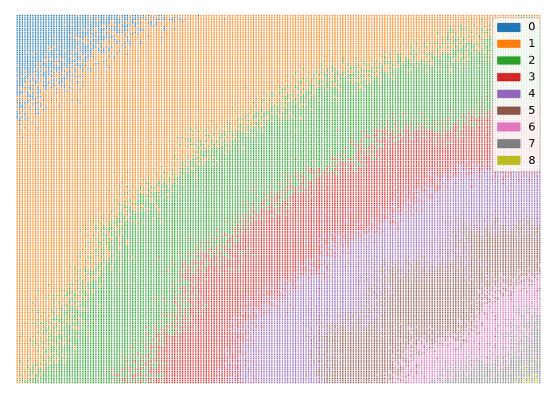
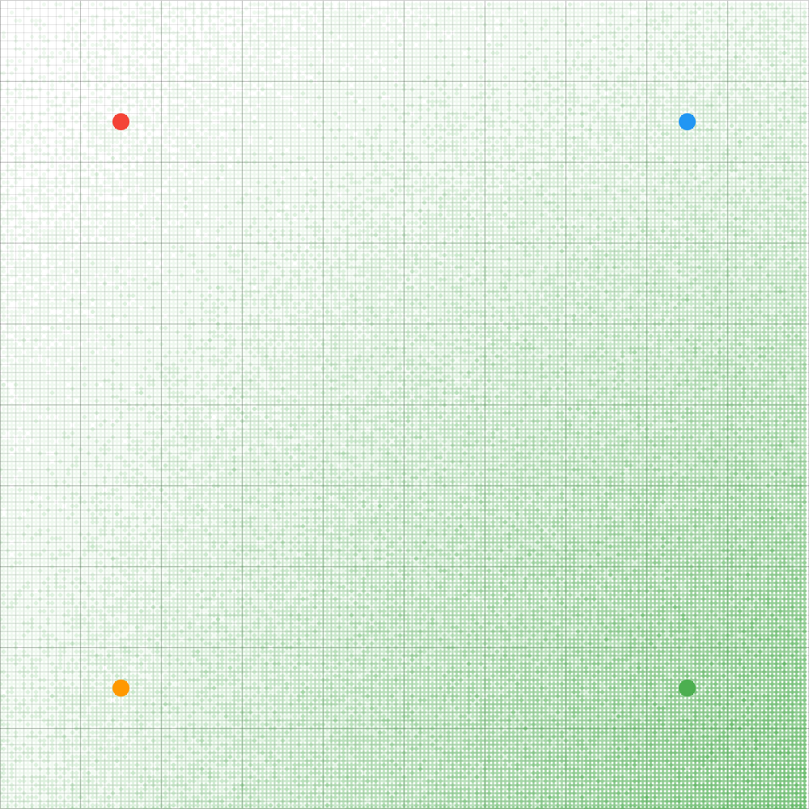
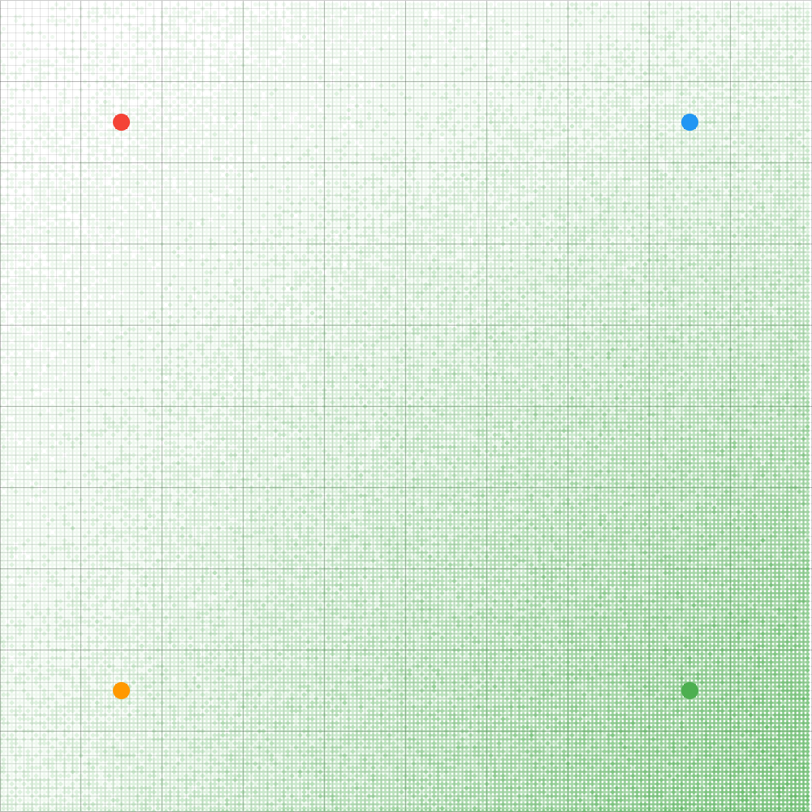

# Approportionment for proportional representation

Like [Yee diagrams](http://zesty.ca/voting/sim/) but for multi-winner electoral methods designed for proportional representation.

The x and y coordinates is a spatial representation of voters and parties. The coloured circles are the parties.

Every coordinate is the voter mean. A normal distribution is generated around that mean coordinate. Every voter casts a ballot and the ballots are counted. The color of that coordinate depends on the type of visualization.

## Number of seats won for party Green

The color of that coordinate is the number of seats won for party Green.

The closer the coordinate is to party Green, means more voters like party Green, so it would win more seats. The further away, the less seats it would win, but it is rarely 0 seats unless if the distance is large enough, because proportional representation awards seats to less popular parties as well.

**D'Hondt**


**Webster/Sainte Lague**


**Droop quota**


**Hare quota**


# Note
Divisor methods (eg D'Hondt, Sainte-Lague) can fail catastrophically if there is a very low number of voters, because it quickly divides the number of remaining votes to 0. When all or most parties have 0 votes, there is no meaningful way to find the party with the most votes to award a seat to.

# Usage

0. Install requirements for plotting `pip install -r requirements.txt`
1. Edit `config.dhall` as you please. The types and validator functions are in `schema.dhall`.
2. Statically type-check and validate the config with `dhall resolve --file config.dhall | dhall normalize --explain`
3. Compile with optimizations for speed with `cargo build --release`
4. `target/release/approportionment config.dhall`
5. `python main.py`

Run tests with

```sh
cargo test
```

## Parallelism

Parallel processing greatly increased the speed. For 1000 voters, it reduced a single-threaded program from 52 seconds to 32 seconds. But there are a lot of loops, where should a loop be parallelized? There are three possible levels of parallelism: at the config level, at the allocation method level, and at the voter level. A permutation of the non-trivial programs were compiled in release mode and renamed so that the benchmarks can be ran like this:

`hyperfine 'target/release/approportionment-{number} config.dhall' -L number 001,011,100,101,110,111,010`

Benchmarks showed that voter-only (001) and config-and-allocation-method (110) are the fastest. The voter-only program has a slightly faster speed, but the difference is within the margin of error. It also has a higher variance of 1 second, while the config-and-allocation-method program has a lower variance of 0.6 seconds. Therefore, I chose to use parallelism at the config and allocation method levels (110).

# See also
## Prior art

* https://github.com/ParkerFriedland/TernaryPlot
* https://web.archive.org/web/20211128200121/https://forum.electionscience.org/t/apportionment-algorithems-visualized/569
    * Forum is shut down, so to see other posts, download the `warc.gz` archive [here](https://archive.org/details/forum.electionscience.org_20200626). Install [pywb](https://github.com/Webrecorder/pywb) to browse the archive to that url.
* https://bolson.org/voting/sim_one_seat/20090810/4b.html

## Single winner

https://github.com/akazukin5151/electoral-systems

## TODO

* https://redrainkim.github.io/assets/images/color-colors-wheel-names-degrees-rgb-hsb-hsv-hue-78027630.jpg
* https://texample.net//media/tikz/examples/PNG/rgb-triangle.png
https://stackoverflow.com/questions/726549/algorithm-for-additive-color-mixing-for-rgb-values

* https://en.wikipedia.org/wiki/Single_transferable_vote#Transfers_of_surplus_votes
* https://en.wikipedia.org/wiki/Counting_single_transferable_votes
