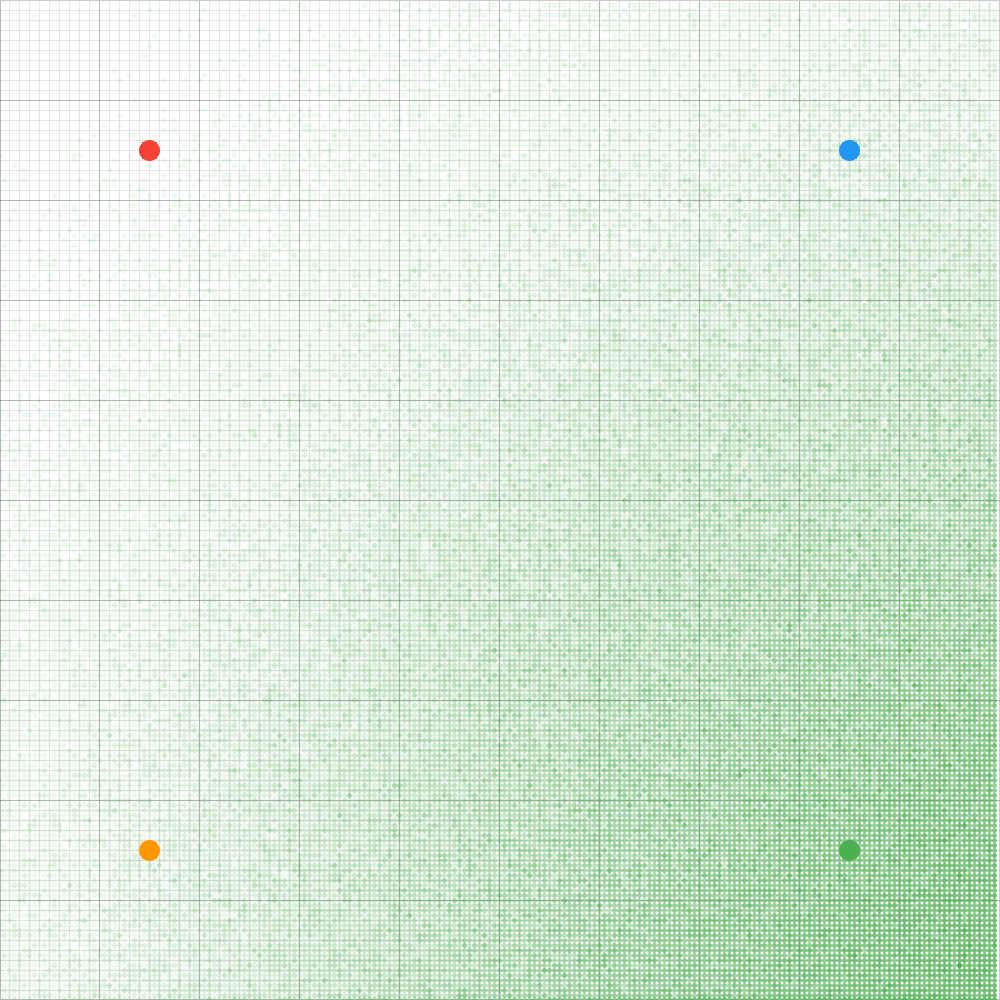
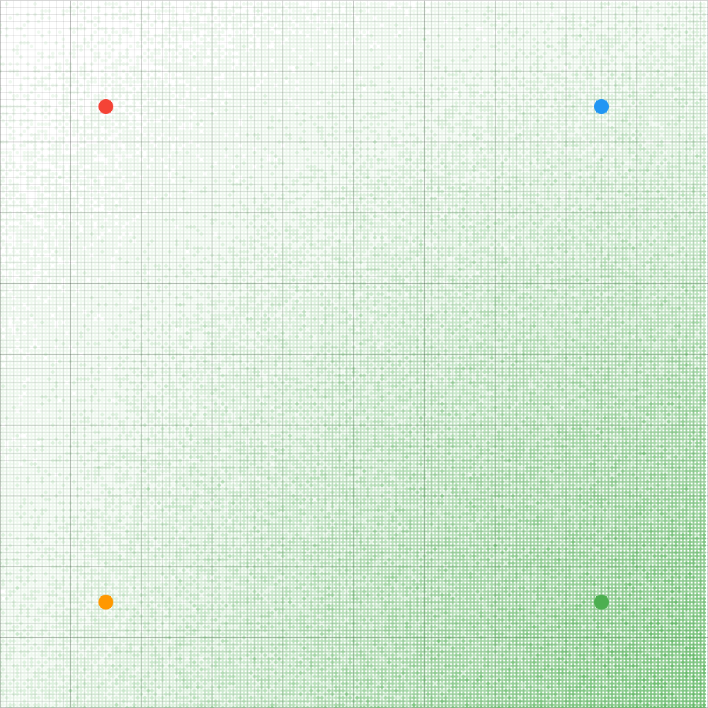

# Approportionment for proportional representation

Like [Yee diagrams](http://zesty.ca/voting/sim/) but for multi-winner electoral methods designed for proportional representation.

The x and y coordinates is a spatial representation of voters and parties. The coloured circles are the parties.

Every coordinate is the voter mean. A normal distribution is generated around that mean coordinate. Every voter casts a ballot and the ballots are counted. The color of that coordinate depends on the type of visualization.

## Number of seats won for party Green

The color of that coordinate is the number of seats won for party Green.

The closer the coordinate is to party Green, means more voters like party Green, so it would win more seats. The further away, the less seats it would win, but it is rarely 0 seats unless if the distance is large enough, because proportional representation awards seats to less popular parties as well.

**D'Hondt**



**Webster/Sainte Lague**


**Droop quota**


**Hare quota**


# Note
Divisor methods (eg D'Hondt, Sainte-Lague) can fail catastrophically if there is a very low number of voters, because it quickly divides the number of remaining votes to 0. When all or most parties have 0 votes, there is no meaningful way to find the party with the most votes to award a seat to.

# Usage

```sh
cargo r -- --help

# Usage: approportionment --color <COLOR> --party-to-colorize <PARTY_TO_COLORIZE> --out-dir <OUT_DIR>
# 
# Options:
#   -c, --color <COLOR>
#           How to color the plot
# 
#           Possible values:
#           - continuous: Number of seats for a party, continuous color palette
#           - discrete:   Number of seats for a party, discrete color palette
#           - average:    Average colors of all parties, weighted by their number of seats
# 
#   -p, --party-to-colorize <PARTY_TO_COLORIZE>
#           If color is continuous or discrete, number of seats for which party? If color is average, this is ignored as all party colors will be blended
# 
#   -o, --out-dir <OUT_DIR>
#           The directory to save output plots
# 
#   -h, --help
#           Print help information (use `-h` for a summary)

cargo run -- --color continuous --party-to-colorize C --out-dir examples/number-of-winners
```

# See also
## Prior art

* https://github.com/ParkerFriedland/TernaryPlot
* https://forum.electionscience.org/t/apportionment-algorithems-visualized/569
    * Forum is shut down, so download the `warc.gz` archive [here](https://archive.org/details/forum.electionscience.org_20200626). Install [pywb](https://github.com/Webrecorder/pywb) to browse the archive to that url.
* https://bolson.org/voting/sim_one_seat/20090810/4b.html

## Single winner

https://github.com/akazukin5151/electoral-systems

## TODO

https://stackoverflow.com/questions/726549/algorithm-for-additive-color-mixing-for-rgb-values

https://en.wikipedia.org/wiki/Single_transferable_vote#Transfers_of_surplus_votes
https://en.wikipedia.org/wiki/Counting_single_transferable_votes
