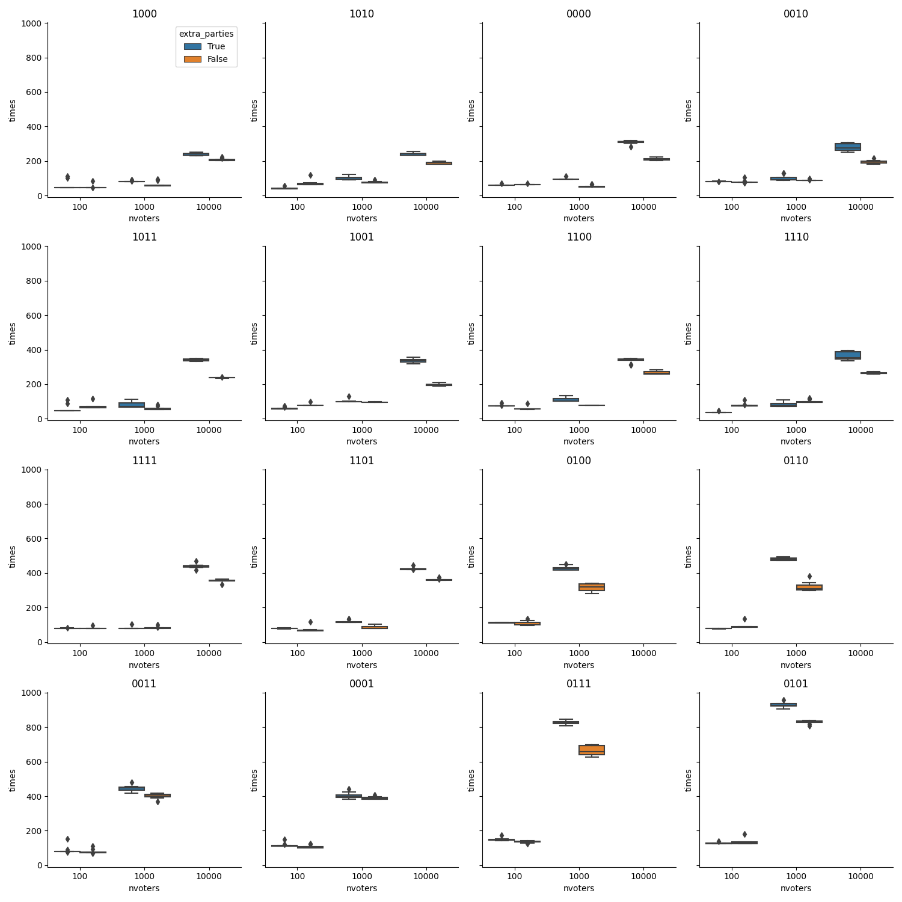
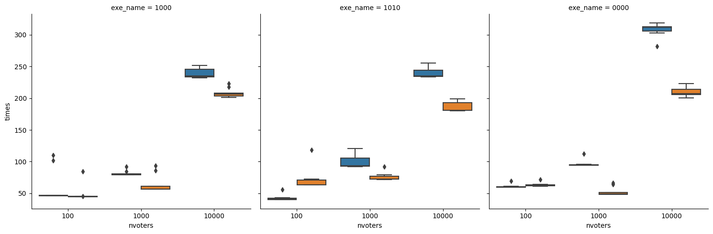

Analysis of benchmarks results ran on Github Actions. Data is from workflow output

https://github.com/akazukin5151/approportionment/suites/10288313817/artifacts/506055209

Missing data is due to workflows that were killed due to taking too much time - don't want to use them anyway!

